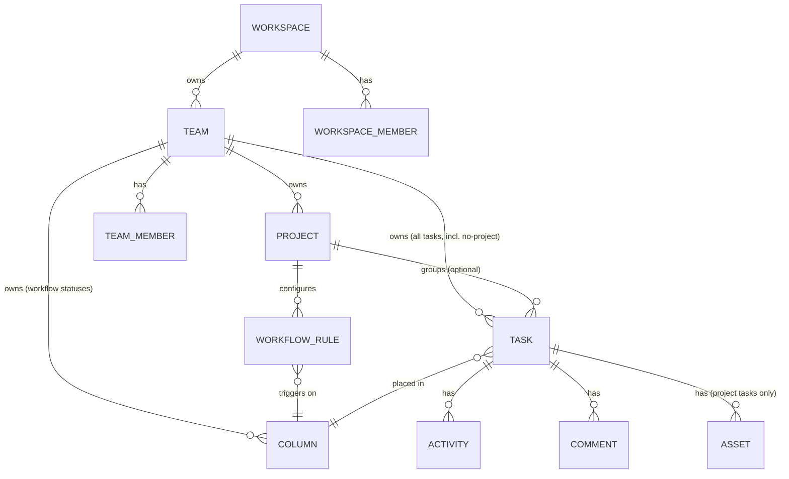
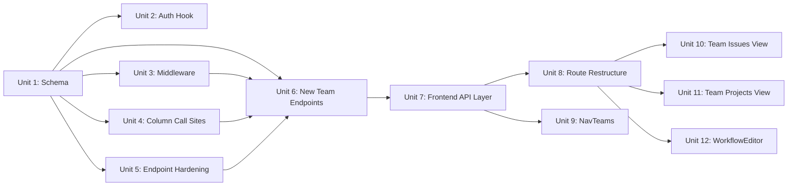

# feat: Migrate to team-centric data model

## Overview

CSP Flow currently organizes work as workspace → project → task. Teams exist in the schema (via Better Auth's organization plugin) but are disconnected from projects and tasks. This plan migrates the core data model to workspace → team → (issues | projects → tasks), making team the atomic unit of ownership — matching Linear's structure.

The change touches the database schema, all column-related backend logic, workspace access middleware, several task controllers, all project-scoped frontend routes, and the sidebar navigation. Existing data is test-only and will be dropped; no backward-compatible migration is needed.

## Problem Frame

Without a team layer, CSP Flow cannot show all work a team owns in one place, filter by team, or build team-first navigation. The orphaned `team` table blocks every meaningful team feature. (See origin: `docs/brainstorms/2026-04-20-team-centric-data-model-requirements.md`)

## Requirements Trace

- R1. Teams own workflow columns — columns are scoped to `teamId`, shared across all team issues and projects
- R2. Teams own issues directly — tasks have a required `teamId` and a nullable `projectId`
- R3. Teams own projects — every project has a required `teamId` FK
- R4. Team-scoped issue numbers — unique constraint `(teamId, number)`, prefixed with team identifier (e.g., `ENG-123`)
- R5. Sidebar is team-first — each team expands to Issues, Projects, Members
- R6. Team Issues view shows all tasks for a team, groupable by project, including no-project tasks
- R7. Team Projects view lists all projects for a team with scoped create action
- R8. New URL structure nests all project routes under `/team/:teamId/`
- R9. Default team and default columns created automatically on workspace creation
- R10. Workspace access middleware handles team-level tasks (null `projectId`)

## Scope Boundaries

- No cross-team projects (a project belongs to exactly one team)
- No per-project workflow overrides (team columns apply uniformly)
- No team-level roles/permissions (teams inherit workspace roles)
- No "My Issues" cross-team view
- Image upload on team-level tasks (no project) is blocked with a 400 — `assetTable.projectId` NOT NULL not changed this phase

### Deferred to Separate Tasks

- Make `assetTable.projectId` nullable to support image upload on team-level tasks: future iteration
- Global search `teamId` filter parameter: search UI unchanged this phase
- Notification subscription model for team-level tasks: future iteration (currently scoped to projects)

## Context & Research

### Relevant Code and Patterns

- Schema: `apps/api/src/database/schema.ts` — `teamTable` (no `$defaultFn`, Better Auth controls IDs), `columnTable` (currently has `projectId`), `taskTable` (currently `projectId` NOT NULL, unique on `(projectId, number)`), `workflowRuleTable` (has both `projectId` and `columnId`)
- Relations: `apps/api/src/database/relations.ts` — `teamTableRelations` currently has no `projects`, `columns`, or `tasks` relations
- Middleware: `apps/api/src/utils/workspace-access-middleware.ts` — strategy-pattern factory; every resource type needs its own lookup case
- Column call sites: `apps/api/src/column/controllers/create-column.ts`, `apps/api/src/task/validate-task-fields.ts`, `apps/api/src/task/controllers/move-task.ts`, `apps/api/src/task/controllers/update-task.ts`, `apps/api/src/task/controllers/bulk-update-tasks.ts`
- Task numbering: `apps/api/src/task/controllers/get-next-task-number.ts` — currently `MAX(number) WHERE projectId = ?`
- Better Auth hook: `apps/api/src/auth.ts` — `afterCreateOrganization` already publishes `workspace.created`; same pattern for default team creation
- Routing: `apps/web/src/routes/_layout/_authenticated/dashboard/workspace/$workspaceId/project/$projectId/` — all deleted this migration
- Sidebar: `apps/web/src/components/nav-projects.tsx` — direct replacement target for `NavTeams`
- AppType: `apps/api/src/index.ts` — union type must be extended for every new route module

### Institutional Learnings

- `docs/solutions/` does not yet exist in this project; the requirements document is the authoritative pre-resolved blocker reference
- Better Auth organization plugin manages `teamTable.id` generation — never use raw `db.insert` for team creation; always go through `organization.createTeam()`
- Project convention: all IDs use `$defaultFn(() => createId())` except `teamTable` and `teamMemberTable`

### External References

- Codebase patterns are well-established for this stack. No external research conducted.

## Key Technical Decisions

- **`teamTable.identifier` field**: User-provided on team creation (required), uppercase letters only, max 5 characters, unique per workspace enforced by DB constraint `(workspaceId, identifier)`. Auto-suggested from team name (first 3 uppercase letters). The default team gets an auto-generated identifier derived from workspace name. (Resolves origin open question #1)
- **Default columns created at team creation**: The `afterCreateOrganization` hook creates both the default team and 4 default columns (To Do, In Progress, In Review, Done) scoped to `teamId`. `create-project.ts` removes its own default column creation. Without this, task status validation fails for all new tasks.
- **Cross-team moves blocked**: `move-task.ts` validates that the destination project's `teamId` matches the source task's `teamId`; returns 400 if they differ. The alternative — updating `task.teamId` on move — would renumber the issue and break the `(teamId, number)` uniqueness guarantee.
- **Middleware fallback for 5 resource types**: `task`, `timeEntry`, `activity`, `comment` all chain through `task → project` currently. All 4 need the null-`projectId` fallback to `task → team → workspace`. The `column` case needs its join changed to `column → team → workspace`.
- **Plugin event dispatch skipped for team-level tasks**: When `task.projectId` is null, skip plugin dispatch in all event handlers (Discord, GitHub, Gitea, generic webhook) and emit a structured log. Plugin integrations are project-scoped per the non-goals.
- **Image upload guard — explicit null check before joins**: The upload and finalize endpoints must check `task.projectId IS NULL` before any join and return 400 immediately. The current INNER JOIN path returns 404 (join returns zero rows), not the specified 400.
- **`GET /tasks/:projectId` endpoint retained**: The project board still needs a task data source. The endpoint's internals are updated to query columns by `teamId` (derived from project), but the route shape is kept.
- **Old frontend routes deleted, no redirects**: No existing users; bookmarks are not a concern. (See origin: implementation notes #7)
- **`workflowRuleTable` unchanged**: Workflow rules remain project-scoped. `WorkflowEditor` derives `teamId` from the project and fetches team columns. (See origin: implementation notes #4)
- **`fromTeam` middleware helper definition**: The `"team"` lookup added in Unit 3 must query `team.workspaceId WHERE team.id = :teamId` and hand the resolved `workspaceId` to `validateWorkspaceAccess`. This lookup must verify the team belongs to the authorized workspace — a `teamId` from workspace B supplied to a workspace A endpoint must return 403, not 400. The `"team"` type must be added to the `WorkspaceIdSource` union in `workspace-access-middleware.ts` before the new team endpoints can use `workspaceAccess.fromTeam(...)`.
- **`GET /teams/:teamId/issues` pagination**: Returns tasks across all projects in a team — potentially unbounded. The endpoint must include a sensible page size limit (e.g., 500 tasks maximum per request, with cursor-based pagination) to prevent large workspaces from turning this into a DoS vector for authenticated users.
- **`columnId` cross-team validation in team issue creation**: When `POST /teams/:teamId/issues` receives a `columnId`, the controller must verify `column.teamId === :teamId` before inserting. This prevents cross-team column injection where a client supplies a `columnId` from a different team.

## Open Questions

### Resolved During Planning

- **Issue identifier format**: Team prefix (e.g., `ENG-123`). Requires `identifier` field on `teamTable`. User confirmed this approach.
- **Default team columns**: Created by `afterCreateOrganization` hook, not by `create-project.ts`. Ensures columns exist before any task can be created in the team.
- **Cross-team task moves**: Blocked with 400. Consistent with team owning its issue number sequence.
- **Middleware coverage**: 5 resource types need the team fallback, not just `task` and `column` as listed in the origin doc. `timeEntry`, `activity`, and `comment` also chain through `task → project`.
- **Project-less task display on project board**: Tasks with `projectId = null` only appear in the Team Issues view, not on project boards. (Origin open question #2 deferred to implementation UX decision.)
- **Plugin dispatch**: Skipped for team-level task events; log only. Integrations are project-scoped.

### Deferred to Implementation

- **`afterCreateOrganization` → `organization.createTeam()` API form**: Better Auth's `organization.createTeam()` may require an active session context that isn't available in the hook callback. If `auth.api.createTeam(...)` with a forged request context doesn't work, fall back to direct `db.insert(teamTable).values({ id: createId(), ... })` — this is acceptable in a server-side hook context where Better Auth is not managing the session. The constraint against raw inserts exists for client-facing code. Verify which approach works during Unit 2 implementation.
- **`bulk-update-tasks.ts` `updateStatus` loop**: The fix is not just the INNER JOIN — the inner loop also extracts `const projectIds = [...new Set(tasks.map((t) => t.projectId))]` and iterates per-project calling `assertValidTaskStatus(value, projectId)`. This entire loop must be rewritten to iterate by `teamId` instead of `projectId`. The exact rewrite depends on seeing the full loop body.
- **`taskTable.status` denormalization**: `task.status` duplicates the column slug. Verify all task-update paths that set `status` use team-scoped column lookups after the migration.
- **Session `activeTeamId`**: Better Auth's session table already has `activeTeamId`. Determine whether frontend should read this to default the active team on login. Low-risk, deferred.
- **`useGetTeams` hook**: No existing TanStack Query wrapper for `authClient.organization.listTeams()` exists in `apps/web/src/hooks/`. Must be created in Unit 7 before `NavTeams` (Unit 9) can use it.

## High-Level Technical Design

> *This illustrates the intended approach and is directional guidance for review, not implementation specification. The implementing agent should treat it as context, not code to reproduce.*

### New Schema Relationships (ERD)

### Unit Dependency Graph

## Implementation Units

---

### Phase 1: Data Layer

---

- [ ] **Unit 1: Schema & Relations**

**Goal:** Update `schema.ts` and `relations.ts` to reflect the new team-centric model. Drop and regenerate all migrations (test data only).

**Requirements:** R1, R2, R3, R4

**Dependencies:** None

**Files:**
- Modify: `apps/api/src/database/schema.ts`
- Modify: `apps/api/src/database/relations.ts`
- Delete: `apps/api/drizzle/` (all existing migration files)
- (Re-generated): `apps/api/drizzle/<new-migration>.sql` — created by `db:generate` after schema changes

**Approach:**
- `teamTable`: add `identifier` column (`text`, NOT NULL), add DB unique constraint on `(workspaceId, identifier)`
- `projectTable`: add `teamId` column (`text`, NOT NULL, FK → `team.id`, cascade delete/update); keep `workspaceId` for direct workspace resolution (do not remove it)
- `columnTable`: replace `projectId` FK with `teamId` FK (`text`, NOT NULL, FK → `team.id`, cascade delete/update); change the slug unique constraint from `(projectId, slug)` → `(teamId, slug)`
- `taskTable`: add `teamId` column (`text`, NOT NULL, FK → `team.id`, cascade delete/update); change `projectId` from NOT NULL → nullable (remove `notNull()`); change unique constraint from `(projectId, number)` → `(teamId, number)`; update the constraint name from `task_project_number_unique` → `task_team_number_unique`
- `relations.ts`: add `columns: many(columnTable)` and `tasks: many(taskTable)` and `projects: many(projectTable)` to `teamTableRelations`; add `team: one(teamTable)` to `projectTableRelations`, `columnTableRelations`, and `taskTableRelations`
- After schema edits: delete all files in `apps/api/drizzle/`, run `db:generate` to produce a single fresh migration

**Test expectation:** none — pure schema DDL. Correctness of constraints is verified by integration tests in subsequent units.

**Verification:**
- `pnpm --filter @kaneo/api db:generate` succeeds without errors
- Generated migration SQL contains `ADD COLUMN team_id` on `project`, `column`, `task`; `ALTER COLUMN project_id DROP NOT NULL` on `task`; new `UNIQUE(team_id, number)` constraint; `UNIQUE(workspace_id, identifier)` on `team`
- **Note:** TypeScript compilation across the monorepo cannot pass from this unit alone — `columnTable.projectId` references in 20+ files (Unit 4 scope) will cause compilation errors. Unit 1 is verified by `db:generate` success only; full compilation verification is gated on Unit 4 completion.

---

- [ ] **Unit 2: Default Team & Columns on Workspace Creation**

**Goal:** When a workspace is created, automatically create a default team (with identifier derived from workspace name) and 4 default workflow columns scoped to that team. Remove default column creation from `create-project.ts`.

**Requirements:** R1, R9

**Dependencies:** Unit 1

**Files:**
- Modify: `apps/api/src/auth.ts`
- Modify: `apps/api/src/project/controllers/create-project.ts`
- Test: `tests/api-integration/workspace/workspace-team-creation.test.ts` (new)

**Approach:**
- In the `afterCreateOrganization` callback in `auth.ts`: after publishing `workspace.created`, call `organization.createTeam({ name: "...", workspaceId })` to create the default team; then insert 4 default columns (`Todo`, `In Progress`, `In Review`, `Done`) with ascending `position` values, scoped to the new team's `id`
- The `identifier` for the default team: derive from workspace name (first 3 characters, uppercase, stripped of non-alpha chars); fall back to `"TEAM"` if the name is too short or fully numeric
- `create-project.ts`: remove the block that inserts default columns; project creation no longer creates any columns
- Note: Better Auth's `organization.createTeam()` does not expose a callback hook itself — the column inserts happen directly in the `afterCreateOrganization` callback after the `createTeam` call resolves

**Test scenarios:**
- Happy path: workspace created → team exists with `workspaceId`, has a non-null `identifier` matching first 3 letters of workspace name → 4 columns exist with `teamId` matching the new team → column slugs are `todo`, `in-progress`, `in-review`, `done`
- Edge case: workspace name is a single character → `identifier` falls back to `"TEAM"`
- Edge case: workspace name contains numbers only → `identifier` falls back to `"TEAM"`
- Error path: `organization.createTeam()` throws → workspace creation should not leave workspace in a team-less state; error is surfaced in the auth callback

**Verification:**
- Creating a new workspace via the UI results in a default team and 4 columns in the DB
- `create-project.ts` no longer inserts any columns
- The `identifier` field on the default team is non-empty and uppercase

---

### Phase 2: Backend API

---

- [ ] **Unit 3: Workspace Access Middleware — Team Resource Fallback**

**Goal:** Update `workspaceAccess` middleware to correctly resolve workspace for all 5 resource types that currently fail when `projectId` is null or when a column's owner is a team.

**Requirements:** R10

**Dependencies:** Unit 1

**Files:**
- Modify: `apps/api/src/utils/workspace-access-middleware.ts`
- Modify: `apps/api/src/task-relation/index.ts` (has its own `INNER JOIN task → project` for workspace resolution, bypasses middleware; must add team fallback)
- Modify: `apps/api/src/notification-preferences/delivery.ts` (INNER JOIN `task → project → workspace`; team-level tasks silently fail)
- Test: `tests/api-integration/middleware/workspace-access.test.ts` (new or extend existing)

**Approach:**
- Add `"team"` to the `WorkspaceIdSource` union type; add `fromTeam(idKey)` named helper to the `workspaceAccess` export object
- `fromTeam` implementation: query `SELECT team.workspaceId FROM team WHERE team.id = :teamId`; hand resolved `workspaceId` to `validateWorkspaceAccess`. The helper must verify the team belongs to the requesting user's authorized workspace — a `teamId` from workspace B in a workspace A request must resolve to workspace B's ID, which then fails `validateWorkspaceAccess` with 403.
- `"task"` case: if `task.projectId IS NOT NULL`, keep existing `task → project → workspaceId` join; if `task.projectId IS NULL`, fall back to `task → team → workspaceId` (LEFT JOIN approach)
- `"column"` case: change join from `column → project → workspaceId` to `column → team → workspaceId`
- `"timeEntry"` case: same null-`projectId` fallback as `"task"`
- `"activity"` case: same null-`projectId` fallback
- `"comment"` case: same null-`projectId` fallback
- `task-relation/index.ts`: add team fallback to its internal `INNER JOIN task → project` workspace validation
- `notification-preferences/delivery.ts`: change INNER JOIN to handle null `projectId` via team; or skip delivery silently with a log when `projectId` is null (consistent with the notification deferral in Scope Boundaries)

**Test scenarios:**
- Happy path: task with `projectId` set → workspace resolved via `task → project`
- Happy path: task with `projectId = null` → workspace resolved via `task → team`
- Happy path: column request → workspace resolved via `column → team`
- Security: `GET /teams/:teamId/issues` where `teamId` belongs to workspace B, user only has workspace A membership → 403 (not 400)
- Security: task with `teamId` referencing a different workspace than the user's session → middleware returns 403
- Error path: task where both `projectId` and `teamId` are null (malformed data) → 400 "Workspace ID could not be determined"
- Integration: comment on a team-level task → workspace resolved without 400
- Integration: task-relation request on a team-level task → workspace resolved without 404

**Verification:**
- Any API request for a resource belonging to a team-level task (null `projectId`) resolves workspace correctly and does not 400
- Cross-workspace `teamId` injection returns 403

---

- [ ] **Unit 4: Column Call Sites Refactor**

**Goal:** Update every place that queries or validates columns by `projectId` to use `teamId` instead. Fix the silent-exclusion bug in `bulk-update-tasks.ts`.

**Requirements:** R1, R2

**Dependencies:** Unit 1

**Files:**

> ⚠️ **Before starting this unit:** Run `grep -r "columnTable\.projectId\|column\.project_id\|column_id.*project" apps/api/src` to find all call sites. The list below is known but incomplete — TypeScript compilation after Unit 1 will enumerate every missed reference as a compile error. Fix all of them before marking this unit complete.

Known call sites:
- Modify: `apps/api/src/task/validate-task-fields.ts`
- Modify: `apps/api/src/task/controllers/move-task.ts`
- Modify: `apps/api/src/task/controllers/update-task.ts`
- Modify: `apps/api/src/task/controllers/update-task-status.ts`
- Modify: `apps/api/src/task/controllers/bulk-update-tasks.ts`
- Modify: `apps/api/src/task/controllers/get-next-task-number.ts`
- Modify: `apps/api/src/task/controllers/get-tasks.ts`
- Modify: `apps/api/src/task/controllers/import-tasks.ts`
- Modify: `apps/api/src/column/controllers/create-column.ts`
- Modify: `apps/api/src/column/controllers/reorder-columns.ts`
- Modify: `apps/api/src/migrations/column-migration.ts` (runs on boot; references `columnTable.projectId`)
- Modify: `apps/api/src/workflow-rule/controllers/upsert-workflow-rule.ts`
- Modify: `apps/api/src/plugins/github/utils/resolve-column.ts`
- Modify: `apps/api/src/plugins/github/services/task-service.ts`
- Modify: `apps/api/src/plugins/gitea/utils/resolve-column.ts`
- Modify: `apps/api/src/plugins/gitea/webhooks/issue-opened.ts`
- Modify: `apps/api/src/activity/index.ts` (publishes `projectId` in event payload; will emit null for team-level tasks)
- Test: `tests/api-integration/task/column-ownership.test.ts` (new)

**Approach:**
- Start with the full grep; fix every call site found before moving to individual controller logic
- `validate-task-fields.ts`: change `getValidTaskStatuses(projectId)` signature to `getValidTaskStatuses(teamId)`; rewrite query to `WHERE columnTable.teamId = ?`; update all call sites to derive or pass `teamId`
- `update-task-status.ts`: this file reads `existingTask.projectId` and passes it to `assertValidTaskStatus` — after migration this is null for team-level tasks; change to read `existingTask.teamId` and pass it to the renamed `getValidTaskStatuses(teamId)`
- `move-task.ts`: `resolveDestinationStatus` queries columns by `teamId` (derived from destination project); add cross-team move guard: if `destinationProject.teamId !== sourceTask.teamId`, throw 400; ensure null-safety on `assetTable.projectId` reassignment
- `update-task.ts`: change column lookup from `eq(columnTable.projectId, projectId)` to `eq(columnTable.teamId, teamId)`
- `bulk-update-tasks.ts`: fix the INNER JOIN issue **and** rewrite the `updateStatus` inner loop — currently extracts `const projectIds = [...new Set(tasks.map((t) => t.projectId))]` and calls `assertValidTaskStatus(value, projectId)` per project; rewrite to group by `teamId` and call `assertValidTaskStatus(value, teamId)` instead
- `get-next-task-number.ts`: change `MAX(number) WHERE projectId = ?` to `MAX(number) WHERE teamId = ?`; update function signature
- `get-tasks.ts`: update column lookup for the project board response shape to query by `teamId` (derived from project)
- `import-tasks.ts`: update `getValidTaskStatuses` call to pass `teamId`
- `create-column.ts`: slug uniqueness check changes from `WHERE project_id = ? AND slug = ?` to `WHERE team_id = ? AND slug = ?`
- `reorder-columns.ts`: column ownership validation changes from `projectId` to `teamId`
- `column-migration.ts`: update or remove the startup migration logic that references `columnTable.projectId` (this may be a no-op migration if columns no longer need per-project defaults)
- `upsert-workflow-rule.ts`: column ownership validation changes from `eq(columnTable.projectId, projectId)` to `eq(columnTable.teamId, teamId)` (derived from the project's `teamId`)
- Plugin resolve-column utilities (`github/utils/resolve-column.ts`, `gitea/utils/resolve-column.ts`): update column queries from `projectId` to `teamId`; guard dispatch for null-`projectId` tasks
- `activity/index.ts`: where `projectId` is published in an event payload, publish `teamId` instead (or include both with `projectId` nullable)

**Test scenarios:**
- Happy path: `assertValidTaskStatus` with a valid team column slug → passes
- Error path: `assertValidTaskStatus` with a slug not in team's columns → throws 400
- Happy path: `update-task-status` on a team-level task (null projectId) → status validated against team columns
- Happy path: create task in project → `getNextTaskNumber(teamId)` returns correct next number across all projects in the team
- Happy path: move task within same team → succeeds, column resolved by `teamId`
- Error path: move task to a project in a different team → 400
- Edge case: bulk-update with mix of project-tasks and team-level tasks → all tasks updated, none silently dropped
- Edge case: bulk-update `updateStatus` operation on team-level task → status validated against team columns (not project columns)
- Happy path: create column → slug unique check scoped to `teamId`
- Error path: create column with duplicate slug for same team → 400
- Happy path: reorder columns → ownership validated by `teamId`
- Integration: API boots without error after `column-migration.ts` is updated

**Verification:**
- `pnpm --filter @kaneo/api typecheck` passes with zero errors (this is the primary completion gate for this unit)
- Task status updates work for both project-scoped and team-level tasks
- Cross-team moves are rejected
- `get-next-task-number` returns team-scoped max + 1

---

- [ ] **Unit 5: Existing Endpoint Hardening**

**Goal:** Update `create-task`, project creation, image upload endpoints, and the workspace projects list to reflect team ownership. Block plugin dispatch for team-level task events.

**Requirements:** R2, R3, R4, R10

**Dependencies:** Unit 1, Unit 4

**Files:**
- Modify: `apps/api/src/task/controllers/create-task.ts`
- Modify: `apps/api/src/task/index.ts` (image upload and finalize endpoints)
- Modify: `apps/api/src/project/controllers/create-project.ts`
- Modify: `apps/api/src/workspace/index.ts` (or wherever `GET /workspaces/:workspaceId/projects` lives)
- Modify: relevant plugin event handler files (Discord, GitHub/Gitea, generic webhook)
- Test: `tests/api-integration/task/team-task-creation.test.ts` (new)
- Test: `tests/api-integration/task/image-upload-guard.test.ts` (new)

**Approach:**
- `create-task.ts`: accept `teamId` as a required field; when `projectId` is also provided, validate that `project.teamId === body.teamId` (or derive `teamId` from the project); call `getNextTaskNumber(teamId)`; pass `teamId` to `assertValidTaskStatus`
- Image upload (`PUT .../image-upload/:id`): before any joins, check if `task.projectId IS NULL`; if so, return 400 ("Image upload is not supported for team-level tasks without a project"); apply same guard to the finalize endpoint
- `create-project.ts`: require `teamId` in the request body; store `teamId` FK; remove default column inserts (done in Unit 2); validate `project.teamId` belongs to the same workspace
- `GET /workspaces/:workspaceId/projects`: include `teamId` in the response shape for each project
- Plugin event handlers: wrap dispatch in a guard — if `task.projectId` is null, log the skipped dispatch and return early; do not pass null `projectId` to plugin queries

**Test scenarios:**
- Happy path: create project-scoped task → `teamId` inherited from project, number is team-scoped, status validated against team columns
- Error path: create project-scoped task with `teamId` that doesn't match project's `teamId` → 400
- Happy path: `GET /workspaces/:workspaceId/projects` → response includes `teamId` per project
- Happy path: image upload on task with `projectId` set → proceeds normally
- Error path: image upload on task with `projectId = null` → 400 (not 404)
- Error path: finalize upload on task with `projectId = null` → 400
- Integration: task status changed on team-level task → plugin event dispatch is skipped, no unhandled rejection

**Verification:**
- Task creation requires `teamId`; tasks in projects inherit `teamId` from the project
- Image upload returns 400 (not 404) for team-level tasks

---

- [ ] **Unit 6: New Team-Scoped Endpoints**

**Goal:** Add `GET/POST /teams/:teamId/columns`, `GET/POST /teams/:teamId/issues`, and `GET/POST /teams/:teamId/projects` endpoints. Wire all new route modules into `AppType`.

**Requirements:** R1, R2, R3, R6, R7

**Dependencies:** Unit 1, Unit 3, Unit 4, Unit 5

**Files:**
- Modify: `apps/api/src/team/index.ts`
- Create: `apps/api/src/team/controllers/get-team-columns.ts`
- Create: `apps/api/src/team/controllers/get-team-issues.ts`
- Create: `apps/api/src/team/controllers/create-team-issue.ts`
- Create: `apps/api/src/team/controllers/get-team-projects.ts`
- Create: `apps/api/src/team/controllers/create-team-project.ts`
- Modify: `apps/api/src/index.ts` (AppType union)
- Test: `tests/api-integration/team/team-endpoints.test.ts` (new)

**Approach:**
- All routes use `workspaceAccess.fromTeam("teamId")` for auth (defined in Unit 3; `teamId` is the URL param key)
- `GET /teams/:teamId/columns`: returns all columns ordered by `position` for the team
- `POST /teams/:teamId/columns`: creates a column for the team; validates slug uniqueness by `teamId`; uses the `create-column` controller refactored in Unit 4
- `GET /teams/:teamId/issues`: returns tasks where `task.teamId = :teamId`, ordered by `position`; includes tasks with null `projectId`; includes `projectId` (nullable) in response for frontend grouping; implement a page size limit (max 500, cursor-based pagination) to prevent unbounded queries across large teams
- `POST /teams/:teamId/issues`: creates a task with `teamId = :teamId`, `projectId = null`; requires `columnId` or `status`; if `columnId` is provided, verify `column.teamId === :teamId` before inserting (reject with 400 if mismatch — prevents cross-team column injection); calls `getNextTaskNumber(teamId)` for issue number
- `GET /teams/:teamId/projects`: returns all projects where `project.teamId = :teamId`
- `POST /teams/:teamId/projects`: creates a project scoped to the team; replaces the old workspace-scoped project create for new callers
- Remove `GET /workspaces/:workspaceId/columns` route (replaced by team-scoped column endpoint)
- All new route objects added to `AppType` union in `apps/api/src/index.ts`

**Patterns to follow:**
- `apps/api/src/project/index.ts` — route structure and `describeRoute` + Valibot validator pattern
- `apps/api/src/task/controllers/create-task.ts` — task creation with number generation
- `apps/api/src/column/controllers/create-column.ts` — column creation with slug uniqueness check

**Test scenarios:**
- Happy path: `GET /teams/:teamId/issues` returns all team tasks including null-project tasks
- Happy path: `POST /teams/:teamId/issues` creates task with `projectId = null`, correct team-scoped number
- Happy path: `GET /teams/:teamId/columns` returns team columns ordered by position
- Happy path: `GET /teams/:teamId/projects` returns only projects for this team
- Happy path: `POST /teams/:teamId/projects` creates project with `teamId` set correctly
- Error path: `POST /teams/:teamId/issues` with `columnId` belonging to a different team → 400 (cross-team column injection blocked)
- Security: `GET /teams/:teamId/issues` where `teamId` belongs to workspace B, user authorized for workspace A → 403
- Error path: request to removed `GET /workspaces/:workspaceId/columns` → 404
- Edge case: `GET /teams/:teamId/issues` with 501+ tasks → pagination cursor returned; only first page (≤500) returned in response

**Verification:**
- All 6 new endpoints respond correctly
- `AppType` union includes all new route modules
- Frontend RPC client (`hc<AppType>`) can call all new endpoints with full type safety

---

### Phase 3: Frontend

---

- [ ] **Unit 7: Frontend API Layer**

**Goal:** Add fetchers and query/mutation hooks for all new team-scoped endpoints. Update existing project and column hooks to reflect `teamId` in response shapes.

**Requirements:** R1, R2, R3, R6, R7

**Dependencies:** Unit 6

**Files:**
- Create: `apps/web/src/fetchers/team/get-team-issues.ts`
- Create: `apps/web/src/fetchers/team/create-team-issue.ts`
- Create: `apps/web/src/fetchers/team/get-team-projects.ts`
- Create: `apps/web/src/fetchers/team/create-team-project.ts`
- Create: `apps/web/src/fetchers/team/get-team-columns.ts`
- Create: `apps/web/src/hooks/queries/team/use-get-teams.ts` (wraps `authClient.organization.listTeams()`; no existing hook — required by NavTeams)
- Create: `apps/web/src/hooks/queries/team/use-get-team-issues.ts`
- Create: `apps/web/src/hooks/queries/team/use-get-team-projects.ts`
- Create: `apps/web/src/hooks/queries/team/use-get-team-columns.ts`
- Create: `apps/web/src/hooks/mutations/team/use-create-team-issue.ts`
- Create: `apps/web/src/hooks/mutations/team/use-create-team-project.ts`
- Modify: `apps/web/src/fetchers/project/get-projects.ts` (add `teamId` to response type)
- Modify: `apps/web/src/hooks/queries/column/use-get-columns.ts` (accept `teamId` instead of `projectId`)

**Approach:**
- All new fetchers use `client.teams[":teamId"]...` RPC paths; types are inferred from `AppType`
- Query keys follow the established pattern: `["team-issues", teamId]`, `["team-columns", teamId]`, `["team-projects", teamId]`
- Remove or deprecate `use-get-columns` by `projectId`; replace with `use-get-team-columns` by `teamId`
- `use-get-team-issues` returns tasks with nullable `projectId` field for grouping

**Patterns to follow:**
- `apps/web/src/hooks/queries/project/use-get-projects.ts`
- `apps/web/src/hooks/mutations/task/use-create-task.ts`
- `apps/web/src/fetchers/project/get-projects.ts`

**Test expectation:** none — fetchers and hooks are thin wrappers; integration covered by E2E flows in views

**Verification:**
- TypeScript compilation passes with no type errors on all new and modified hooks
- Query invalidation patterns follow existing conventions (e.g., after `createTeamIssue`, invalidate `["team-issues", teamId]`)

---

- [ ] **Unit 8: Route Restructure**

**Goal:** Delete all old workspace-project routes and create the new team-nested route tree. Stub view content where implementations are added in Units 10–12.

**Requirements:** R8

**Dependencies:** Unit 7

**Files:**
- Delete: `apps/web/src/routes/_layout/_authenticated/dashboard/workspace/$workspaceId/project/` (entire directory)
- Create: `apps/web/src/routes/_layout/_authenticated/dashboard/workspace/$workspaceId/team/$teamId/issues/index.tsx`
- Create: `apps/web/src/routes/_layout/_authenticated/dashboard/workspace/$workspaceId/team/$teamId/projects/index.tsx`
- Create: `apps/web/src/routes/_layout/_authenticated/dashboard/workspace/$workspaceId/team/$teamId/members.tsx`
- Create: `apps/web/src/routes/_layout/_authenticated/dashboard/workspace/$workspaceId/team/$teamId/project/$projectId/board.tsx`
- Create: `apps/web/src/routes/_layout/_authenticated/dashboard/workspace/$workspaceId/team/$teamId/project/$projectId/backlog.tsx`
- Create: `apps/web/src/routes/_layout/_authenticated/dashboard/workspace/$workspaceId/team/$teamId/project/$projectId/gantt.tsx`
- Create: `apps/web/src/routes/_layout/_authenticated/dashboard/workspace/$workspaceId/team/$teamId/project/$projectId/task/$taskId_.tsx`

**Approach:**
- Each new route file declares `createFileRoute(...)` with the full URL path matching its file path
- `$teamId` and `$projectId` are read from route params; `$workspaceId` is also available via params
- Project board, backlog, and gantt routes retain their existing component logic, updated to read `teamId` from params and pass it to column/task hooks
- Old gantt route passes existing `GanttTimeline`, `buildTimeline`, `ZoomLevel` utilities unchanged (gantt display logic is not scope of this migration)
- Old `task/$taskId_` route: task detail panel logic carries over; update any column lookups to use `teamId`

**Test expectation:** none — route file declarations; correctness verified by compilation and visual navigation tests

**Verification:**
- TypeScript compilation passes (TanStack Router code-gen succeeds)
- Navigating to `/dashboard/workspace/:id/team/:teamId/issues` loads without a 404
- Old `/dashboard/workspace/:id/project/:projectId/board` routes return 404 (deleted)

---

- [ ] **Unit 9: NavTeams Sidebar Component**

**Goal:** Replace `NavProjects` with `NavTeams`. Each team is collapsible and expands to Issues, Projects, and Members links with nested project list.

**Requirements:** R5

**Dependencies:** Unit 7, Unit 8

**Files:**
- Create: `apps/web/src/components/nav-teams.tsx`
- Modify: `apps/web/src/components/app-sidebar.tsx`
- Delete: `apps/web/src/components/nav-projects.tsx` (or retire if used elsewhere)

**Approach:**
- `NavTeams` fetches teams via `useGetTeams({ workspaceId })` (existing query hook); fetches projects per team via `useGetTeamProjects({ teamId })` for each expanded team
- Each team renders: a collapsible section header with team name and identifier; links to Issues (`/team/:teamId/issues`), Projects (`/team/:teamId/projects`), Members (`/team/:teamId/members`); a nested list of project links under Projects
- Default state: teams are expanded; collapse state is local UI state (not persisted)
- "Create Team" action triggers Better Auth's `authClient.organization.createTeam()` (already available via Better Auth client)
- `app-sidebar.tsx`: remove `<NavProjects />`, render `<NavTeams workspaceId={workspaceId} />` in its place

**Patterns to follow:**
- `apps/web/src/components/nav-projects.tsx` — structure and navigation pattern
- Collapsible sidebar sections already exist in the codebase (follow existing Radix/Tailwind pattern)

**Test expectation:** none — UI component; verified by visual inspection

**Verification:**
- Sidebar renders the team list with Issues / Projects / Members links per team
- Clicking a team link navigates to the correct team-scoped route
- Teams are collapsed/expanded without page navigation

---

- [ ] **Unit 10: Team Issues View**

**Goal:** Implement the team issues view at `/team/:teamId/issues` — shows all team tasks in board and list views, with grouping by project and a "No Project" bucket.

**Requirements:** R6

**Dependencies:** Unit 7, Unit 8

**Files:**
- Modify: `apps/web/src/routes/_layout/_authenticated/dashboard/workspace/$workspaceId/team/$teamId/issues/index.tsx`
- Create: `apps/web/src/components/team-issues/team-issues-board.tsx`
- Create: `apps/web/src/components/team-issues/team-issues-list.tsx`

**Approach:**
- Route file calls `useGetTeamIssues({ teamId })` and `useGetTeamColumns({ teamId })`
- Board view: same drag-to-move column mechanics as existing project board; uses team columns (not project columns); tasks grouped by column
- List view: tasks rendered as rows; supports grouping-by-project toggle (tasks with matching `projectId` grouped under project name; tasks with `projectId = null` grouped under "No Project")
- Create issue button defaults to the current team with `projectId = null`; opens the existing task creation modal/sheet with `projectId` field optional
- View toggle (board/list) uses the same local state pattern as existing board/list views

**Patterns to follow:**
- `apps/web/src/routes/.../project/$projectId/board.tsx` — board column drag-and-drop
- Existing task list / backlog component for list view conventions

**Test expectation:** none — UI component; verified by visual inspection and manual flow testing

**Verification:**
- All team tasks appear (including tasks with null `projectId`)
- Switching to list view and grouping by project shows correct buckets including "No Project"
- Creating an issue from this view creates a task with `projectId = null`

---

- [ ] **Unit 11: Team Projects View**

**Goal:** Implement the team projects view at `/team/:teamId/projects` — lists all projects for the team with a scoped create action.

**Requirements:** R7

**Dependencies:** Unit 7, Unit 8

**Files:**
- Modify: `apps/web/src/routes/_layout/_authenticated/dashboard/workspace/$workspaceId/team/$teamId/projects/index.tsx`

**Approach:**
- Route calls `useGetTeamProjects({ teamId })`
- Each project is rendered as a card or row linking to its board (`/team/:teamId/project/:projectId/board`)
- "Create Project" button invokes `useCreateTeamProject({ teamId })`; the create form does not expose a `teamId` selector — it is always the current team
- Empty state: "No projects yet — create your first project"

**Patterns to follow:**
- Existing workspace projects list (if one exists) or `NavProjects` component's project rendering

**Test expectation:** none — UI component; verified by visual inspection

**Verification:**
- Projects list renders for the team
- Create project action creates a project with the correct `teamId`
- Navigating to a project from the list lands on the correct board route

---

- [ ] **Unit 12: WorkflowEditor Column Source Update**

**Goal:** Update `WorkflowEditor` to fetch columns from the team (derived from the project's `teamId`) rather than from the project.

**Requirements:** R1

**Dependencies:** Unit 7

**Files:**
- Modify: `apps/web/src/routes/_layout/_authenticated/dashboard/workspace/$workspaceId/team/$teamId/project/$projectId/` (settings/workflow route, once path is confirmed in the new route tree)

**Approach:**
- The workflow settings route now lives under the team-nested project path; `teamId` is available directly from route params
- Replace `useGetColumns({ projectId })` with `useGetTeamColumns({ teamId })`
- The two-step fetch (project → teamId → columns) is eliminated because `teamId` is now a URL param in all project routes
- Workflow rule creation and editing logic is unchanged; only the column source changes

**Test expectation:** none — UI wiring; verified by loading the workflow settings page and confirming team columns appear

**Verification:**
- Opening workflow settings for a project shows the team's columns (not a project-specific column list)
- Creating/editing workflow rules works against the correct column set

---

## System-Wide Impact

- **Interaction graph:** `workspaceAccessMiddleware` is called on every authenticated API request involving a resource — all 5 resource cases (`task`, `column`, `timeEntry`, `activity`, `comment`) require the team-fallback branch. The `afterCreateOrganization` callback in Better Auth is a side-effect hook; failures there may not surface in the workspace creation response.
- **Error propagation:** Null `projectId` on a task must not cause an unhandled join failure — all join paths must guard explicitly. Plugin event dispatch errors for team-level tasks should be caught and logged, not propagated as 500s.
- **State lifecycle risks:** The `(teamId, number)` unique constraint on `task` creates a window during team creation where no columns exist — `assertValidTaskStatus` will reject all statuses until default columns are created. Unit 2 must ensure columns are created before any task creation is possible.
- **API surface parity:** The `GET /tasks/:projectId` endpoint is retained for the project board view and must have its internal column lookups updated to query by `teamId` (derived from project). Removing it would break the project board.
- **Integration coverage:** Cross-layer tests that matter most: (1) workspace creation → default team + columns exist → task creation succeeds; (2) team-level task → middleware resolves workspace → comment/activity APIs work; (3) cross-team move → 400 returned before any DB write.
- **Unchanged invariants:** `milestone`, `wikiPage`, `githubIntegration`, `integration` all stay scoped to projects and are unaffected. `activity`, `comment`, `label`, `asset` stay scoped to tasks — only their workspace resolution path changes via middleware. Gantt chart display logic (`ZoomLevel`, `buildTimeline`, `gantt-status-colors.ts`) is unchanged; only the route wrapper and column data source change.

## Risks & Dependencies

| Risk | Likelihood | Impact | Mitigation |
|------|-----------|--------|------------|
| Column call sites number 20+; compilation fails if any are missed after Unit 1 | High | High | Run full grep before starting Unit 4; treat TypeScript compilation pass as the Unit 4 completion gate, not individual file verification |
| `afterCreateOrganization` hook cannot call `organization.createTeam()` in the expected form → team creation fails silently | Med | High | Verify API form during Unit 2; fall back to `db.insert` with `createId()` in hook context if needed |
| `afterCreateOrganization` column creation fails partially → team exists with no columns → all task creation fails | Low | High | Wrap column inserts in a try/catch; log + surface error; consider idempotent re-run on next boot |
| `update-task-status.ts` missed in Unit 4 → all task status drags on team-level tasks silently fail | High | High | File is explicitly listed in Unit 4; confirm inclusion before starting |
| `fromTeam` middleware helper missing team-ownership verification → cross-workspace `teamId` injection returns 400 instead of 403 | Med | Med | Security test in Unit 3 explicitly tests cross-workspace `teamId` injection → 403 |
| `POST /teams/:teamId/issues` with `columnId` from different team creates cross-team data inconsistency | Med | Med | `columnId` cross-team validation specified in Unit 6; integration test covers it |
| `AppType` not updated for new route modules → frontend RPC client has no type coverage | Med | Med | TypeScript compilation catches this — verify `pnpm typecheck` passes after Unit 6 |
| Plugin event handlers (`resolve-column.ts`) fail compilation after Unit 1 | High | High | Listed in Unit 4 file list; compilation gate in Unit 4 catches any that are missed |

## Phased Delivery

### Phase 1 — Data Layer
Units 1–2. Schema changes and default team creation. Backend compiles and all existing tests pass (with DB reset). No frontend changes yet.

### Phase 2 — Backend API
Units 3–6. All middleware and call-site fixes. New team endpoints live. Full API test coverage. Frontend still uses old routes.

### Phase 3 — Frontend
Units 7–12. New API layer, route restructure, NavTeams, team views, WorkflowEditor fix. All acceptance criteria verifiable end-to-end.

## Documentation / Operational Notes

- Drop and recreate the database before running Phase 1. Delete all files in `apps/api/drizzle/`, regenerate migrations with `db:generate`, then restart the API.
- Phase 1 and Phase 2 (backend) must be completed together before the app is in a working state — the frontend still uses old routes until Phase 3. Between phases, the app is functional only via direct API calls with a fresh DB.
- After Unit 4 ships: run `pnpm --filter @kaneo/api typecheck` as the primary verification that all call sites are fixed. A clean typecheck is the completion gate.
- The `identifier` field on teams should be exposed in the team creation and team settings UI (future task if not in scope of current views).
- `GET /teams/:teamId/issues` is paginated (max 500 per page, cursor-based). Frontend views must handle pagination if teams grow large.

## Sources & References

- **Origin document:** [`docs/brainstorms/2026-04-20-team-centric-data-model-requirements.md`](docs/brainstorms/2026-04-20-team-centric-data-model-requirements.md)
- Schema: `apps/api/src/database/schema.ts`
- Relations: `apps/api/src/database/relations.ts`
- Middleware: `apps/api/src/utils/workspace-access-middleware.ts`
- Auth hook: `apps/api/src/auth.ts`
- Column call sites: `apps/api/src/task/validate-task-fields.ts`, `apps/api/src/task/controllers/move-task.ts`, `apps/api/src/task/controllers/update-task.ts`, `apps/api/src/task/controllers/bulk-update-tasks.ts`
- Task numbering: `apps/api/src/task/controllers/get-next-task-number.ts`
- Frontend sidebar: `apps/web/src/components/nav-projects.tsx`, `apps/web/src/components/app-sidebar.tsx`
- Frontend routing: `apps/web/src/routes/_layout/_authenticated/dashboard/workspace/$workspaceId/project/`
